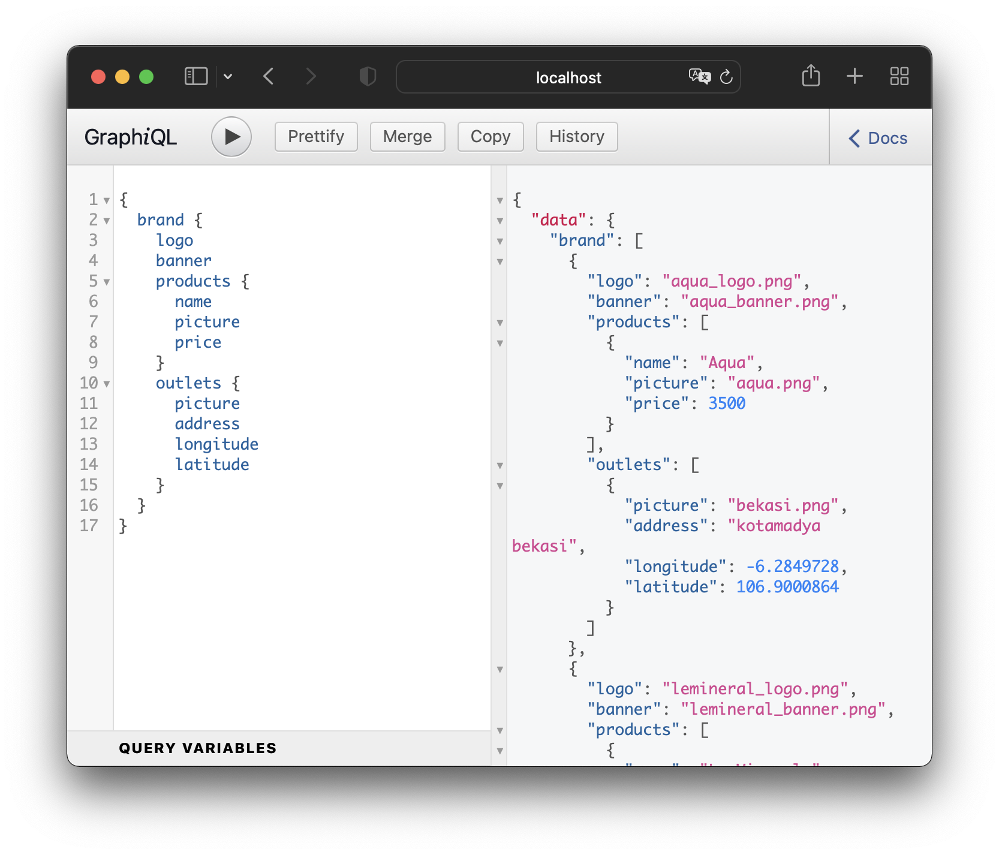

# sequelize-graphql-express (sge)



This app combines `sequelize` to store data, `graphql` to display data, and `express` to serve webapp.

## Setup
Install all packages
```
npm install
```

Run db-server with `docker-compose`
```
docker-compose up
```

Create all tables with migrate
```
npm run migrate
```

Insert all data with seed
```
npm run seed
```

Run app server
```
npm start
```

Open The GraphQL interface on this result
```
Now browse to http://localhost:4000
```

## How to build from scratch

This is step by step how we build this app from scratch.

```
mkdir sequelize-graphql-express && cd sequelize-graphql-express
```

Initiate app
```
npm init --yes
```

Install `sequelize-cli` & `eslint`
```
npm i sequelize-cli eslint -D
```

Install `sequelize` and `pg` (postgres)
```
npm i sequelize pg
```

Setup eslint for identifying problematic patterns found in JavaScript code.
```
npm init @eslint/config
```

Create a local vscode preference in the `.vscode` folder. It is used to format js files with eslint configuration on save.

```json
{
  "editor.formatOnSave": false,
  "editor.codeActionsOnSave": {
    "source.fixAll.eslint": true
  },
  "eslint.validate": [
    "javascript",
    "typescript"
  ],
  "editor.detectIndentation": false,
  "editor.tabSize": 2
}
```

Create `.sequelizerc` file. This is config file for `sequelize-cli`.
```js
const path = require('path');

module.exports = {
  'config': path.resolve('config', 'config.json'),
  'models-path': path.resolve('db', 'models'),
  'seeders-path': path.resolve('db', 'seeders'),
  'migrations-path': path.resolve('db', 'migrations')
};
```

Initiate sequelize folders and files
```
npx sequelize-cli init
```

Generate the brand model
```
npx sequelize-cli model:generate --name Brand --attributes name:string,logo:string,banner:string
```

Generate the outlet model
```
npx sequelize-cli model:generate --name Outlet --attributes name:string,picture:string,address:string,longitude:float,latitude:float,brand_id:integer
```

Generate the product model
```
npx sequelize-cli model:generate --name Product --attributes name:string,picture:string,price:integer,brand_id:integer
```

Generate seeder files
```
npx sequelize-cli seed:generate --name demo-brand
npx sequelize-cli seed:generate --name demo-outlet
npx sequelize-cli seed:generate --name demo-product
```